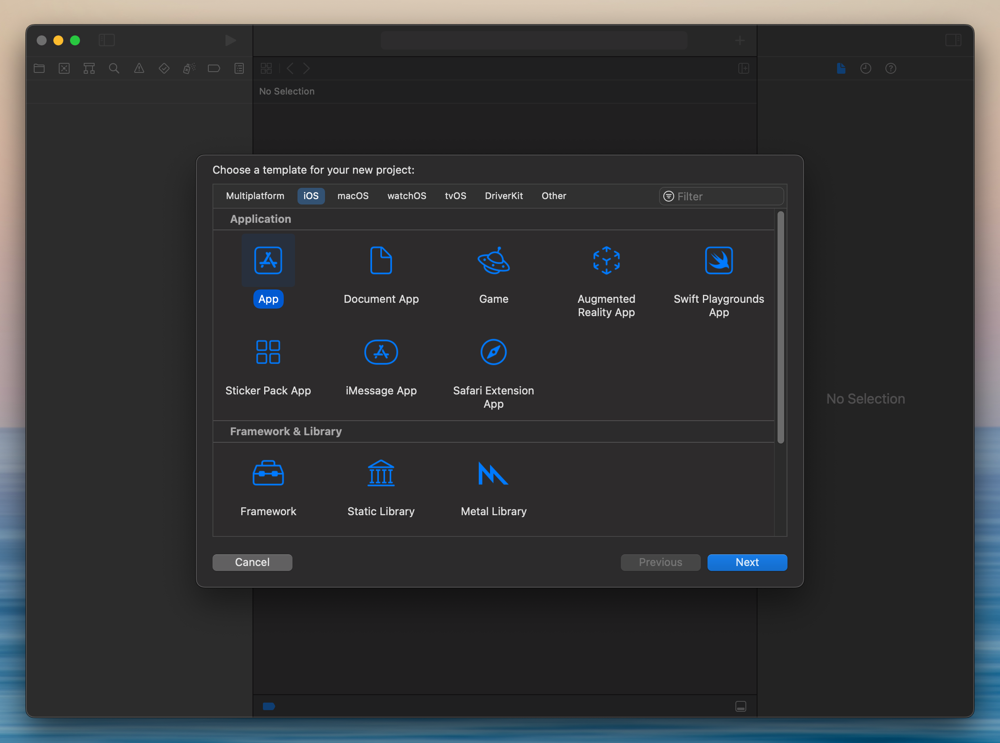
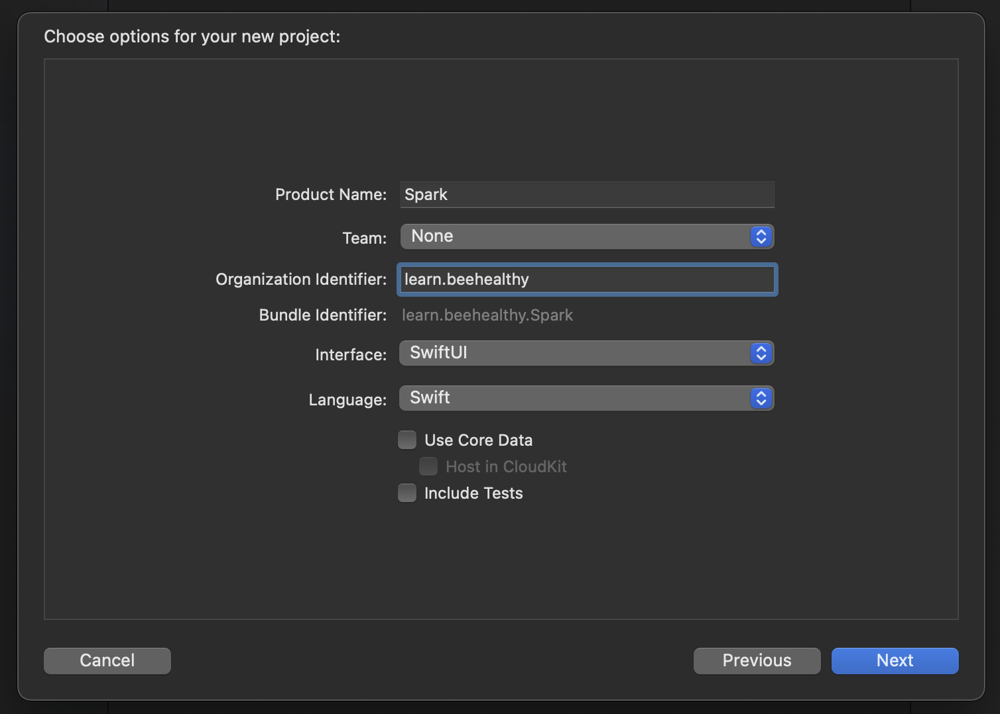
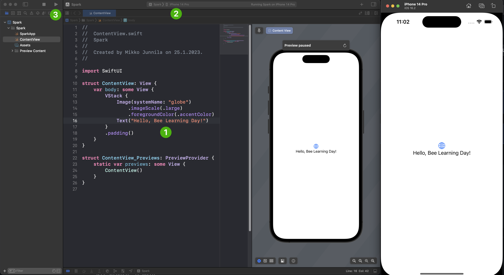
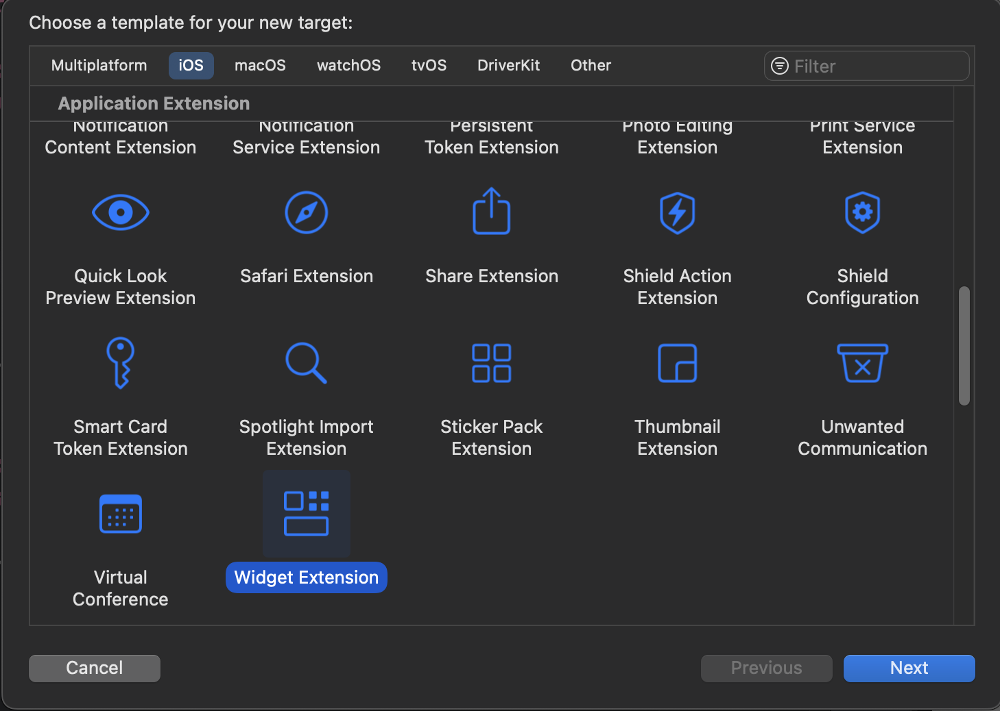
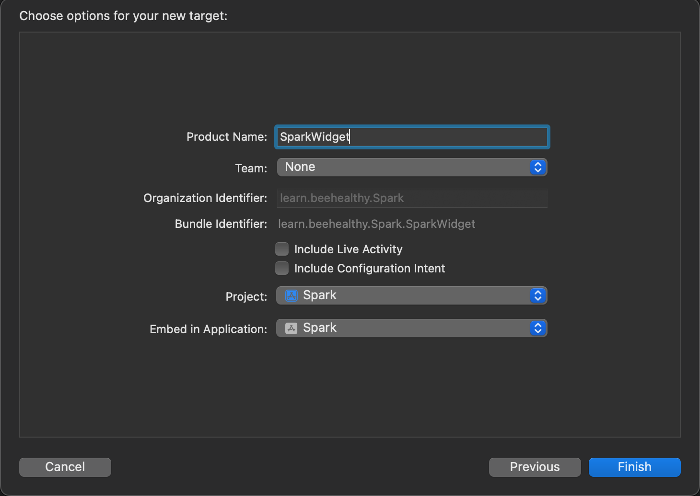
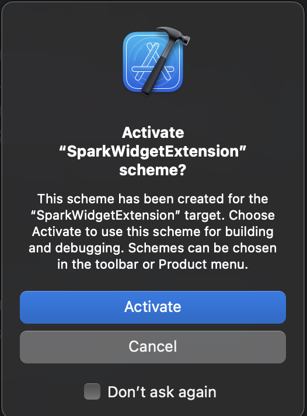
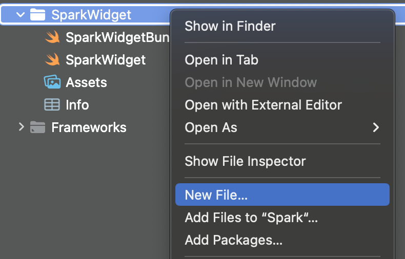
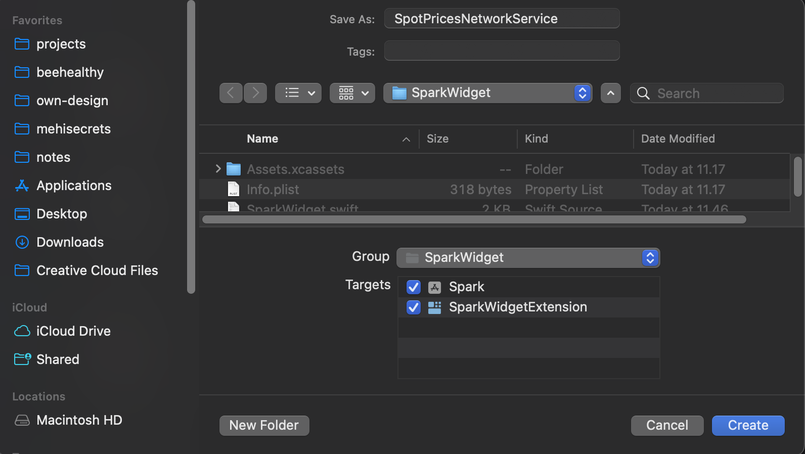
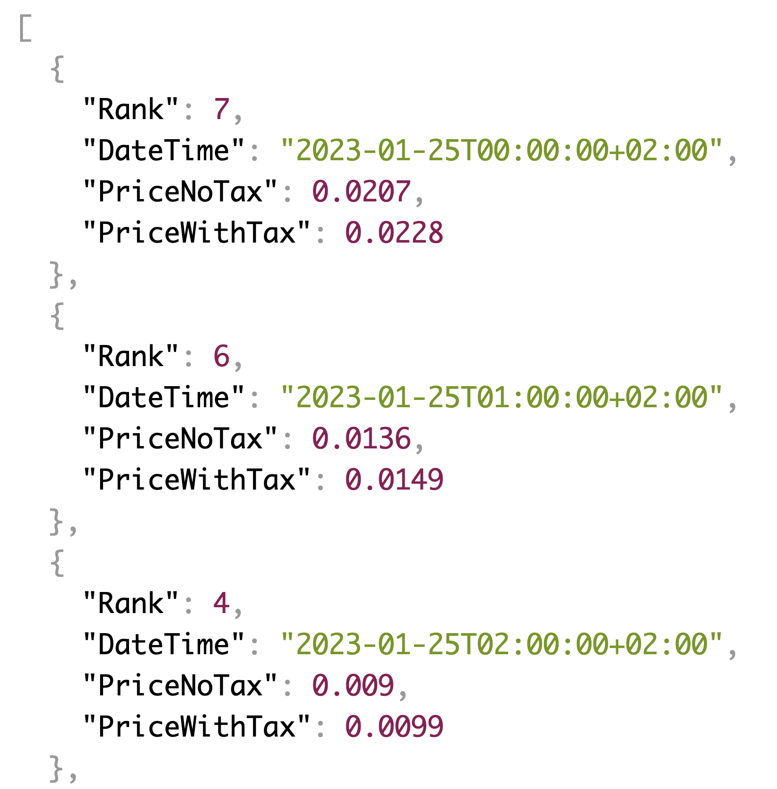
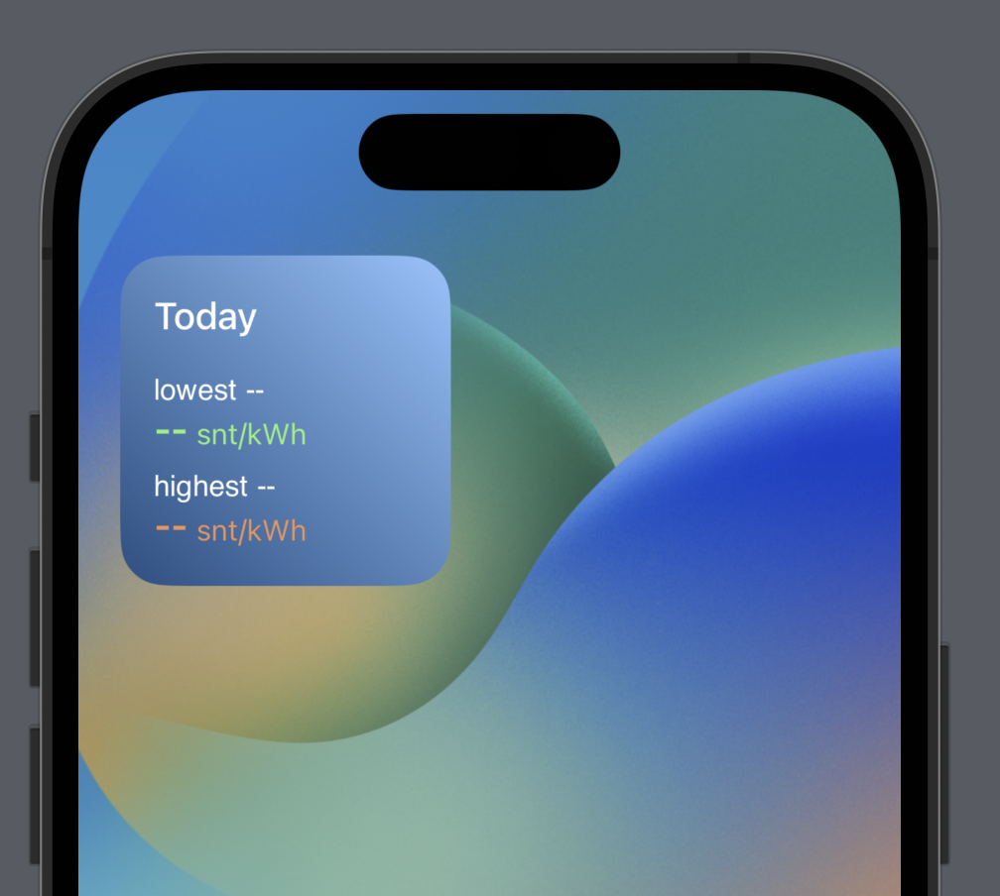

# Spark iOS

## Background

### WidgetKit
WidgetKit allows us to show relevant, glanceable content from our app as widgets in iOS and macOS, and as watch complications.

To implement a widget, one adds a widget extension to your app. We then configure the widget with a timeline provider, and use SwiftUI views to display the widget’s content. The timeline provider tells WidgetKit when to update your widget’s content.

### Timeline
To tell WidgetKit when to update a widget’s view, `TimelineProvider` generates a timeline. The timeline contains an array of timeline entry objects and a refresh policy.

To create timeline entries, declare a custom type that conforms to `TimelineEntry`. Each entry specifies the date you would like WidgetKit to update the widget’s view, and any additional information that your widget needs to render the view.

## Useful links
[Apple: Keeping a Widget Up To Date](https://developer.apple.com/documentation/widgetkit/keeping-a-widget-up-to-date)
[Create app icons using AI](https://appicons.ai/)

# Step-By-Step Instructions

We'll build an eletricity related Widget Extension to help us go about our day with eletricity spot prices being volatile (Early 2023).

## Step 1. Let's create a Xcode project and add a Widget target

1. Create a new project in Xcode


2. Select a name for the project and use default SwiftUI options


3. Select a location for the project and tap **Create**.

- Let's design a simple small widget type layout in Figma
- Let's try a Figma plugin for exporting SwiftUI code

4. Let's make sure app runs fine
   1. Make some small change in the `ContentView` text
   2. Make sure a simulator is selected, e.g. **iPhone 14 Pro**
   3. Run the simulator with the Play button
   

5. Let's add a **Widget Target** in our App

   The Widget Extension template provides a starting point for creating your widget. A single widget extension can contain multiple widgets. For example, a sports app might have one widget that displays team information, and another that displays game schedules. A single widget extension could contain both widgets.

   1. Open your app project in Xcode and choose File > New > Target.
   

   2. From the Application Extension group, select Widget Extension, and then click Next.
   3. Enter the name of your extension: **SparkWidget**
   4. Our widget won't provides user-configurable properties or Live Activity for now, so we'll uncheck both checkboxes.
      
   5. Click Finish.
   6. Activate SparkWidgetExtension scheme to help us more quickly iterate on building and debugging the widget.
   

6. Make sure the widget runs fine
   1. You can find the initial code for the widget under it's own folder.
   2. Try running the widget.
   3. You should see it open.
  


## Step 2: Let's build a simple network service to fetch spot prices
1. Right-click SparkWidget folder and select Add file
  
2. Select Swift File and tap **Next**.
3. Enter `SpotPricesNetworkService` as the name
4. Check SparkWidgetExtension as target so it will be included in our widget extension.
5. Tap **Create**.
  

   We will be using [https://api.spot-hinta.fi/Today](https://api.spot-hinta.fi/Today) to fetch the spot price data. Here's an example of the returned JSON from our API.
   

6. Add another Swift file in a similar fashion, this time calling it `SpotPrice`. This will define our data model for network returned spot prices.
7. Enter the following struct as the content for `SpotPrice` file.
   ```Swift
    import Foundation

    public struct SpotPrice: Decodable {
        let Rank: Int?
        let DateTime: Date?
        let PriceWithTax: Float?

        init(Rank: Int?, DateTime: Date?, PriceWithTax: Float?) {
            self.Rank = Rank
            self.DateTime = DateTime
            self.PriceWithTax = PriceWithTax
        }
    }
    ```
    Here we are modeling it's returned JSON with a Decodable struct. Decodable is a [protocol](https://docs.swift.org/swift-book/LanguageGuide/Protocols.html) that helps us use JSON decoder later to decode the API responses.

8. Let's build our network service. It will have one simple function to fetch the current prices and return them as an array.
    ```Swift
    import Foundation

    public class SpotPricesNetworkService {
        func fetchPrices() async -> [SpotPrice] {
            let url = URL(string: "https://api.spot-hinta.fi/Today")!
            let urlSession = URLSession.shared
            let decoder = JSONDecoder()
            decoder.dateDecodingStrategy = .iso8601

            do {
                let (data, _) = try await urlSession.data(from: url)
                let spotPrices = try decoder.decode([SpotPrice].self, from: data)
                return spotPrices
            } catch {
                debugPrint("Error loading \(url): \(String(describing: error))")
                return []
            }
        }
    }
    ```
    We'll utilize [URLSession](https://developer.apple.com/documentation/foundation/urlsession) class to help us handle network related tasks, and the date decoding strategy to help us decode ISO-8601-formatted strings.

## Step 2: Let's build the UI for our Widget
UIs for widgets are built with SwiftUI. In the interest of time, we'll share the SwiftUI code for the sample UI. But feel free to play around with the layout. This sample Widget UI code was generated from Figma using a plugin ([Sigma](https://www.figma.com/community/plugin/1055606842094169320/Sigma)) to export Figma layouts to SwiftUI code. This can be helpful to get you going.

If you want, you can spend time with the initial part of Apple's SwiftUI tutorial to see how basic layout components like Stacks in SwiftUI work:
[SwiftUI: Creating and Combining views](https://developer.apple.com/tutorials/swiftui/creating-and-combining-views)

Let's start by defining our `TimelineEntry` struct. This will define all the data we need to show the UI for our Widget. We'll call it `SpotPricesForDayEntry`.

1. Rename the default `SimpleEntry` to `SpotPricesForDayEntry` (right-click > Refactor > Rename)
2. Update it's content as follows
    ```Swift
    struct SpotPricesForDayEntry: TimelineEntry {
        let date: Date
        let lowestPrice: SpotPrice?
        let highestPrice: SpotPrice?
        
        init(date: Date, lowestPrice: SpotPrice? = nil, highestPrice: SpotPrice? = nil) {
            self.date = date
            self.lowestPrice = lowestPrice
            self.highestPrice = highestPrice
        }
    }
    ```

3. Replace the current `SparkWidgetEntryView`
    ```Swift
    struct SparkWidgetEntryView : View {
        var entry: Provider.Entry

        var body: some View {
            Text(entry.date, style: .time)
        }
    }
    ```
    with the updated one, including a helper `getFormattedDate() function`:

    ```Swift
    func getFormattedDate(date: Date?, format: String) -> String? {
        guard let date = date else { return nil }
        let dateformat = DateFormatter()
        dateformat.dateFormat = format
        return dateformat.string(from: date)
    }

    struct SparkWidgetEntryView: View {
        var entry: Provider.Entry
        let formatter = DateFormatter()

        init(entry: Provider.Entry) {
            self.entry = entry

            formatter.dateStyle = .none
            formatter.timeStyle = .long
        }

        var body: some View {
            VStack(alignment: .leading, spacing: 16) {
                Text("Today")
                    .font(.system(size: 18, weight: .medium))
                    .foregroundColor(Color(red: 1, green: 1, blue: 1))

                VStack(alignment: .leading, spacing: 8) {
                    VStack(alignment: .leading, spacing: 0) {
                        HStack(alignment: .top, spacing: 4) {
                            Text("lowest")
                                .font(.custom("SF Pro Text", size: 14))
                                .foregroundColor(Color(red: 1, green: 1, blue: 1))
                            Text(
                                getFormattedDate(
                                    date: entry.lowestPrice?.DateTime,
                                    format: "HH.mm"
                                ) ?? "--"
                            )
                            .font(.custom("SF Pro Text", size: 14))
                            .foregroundColor(Color(red: 1, green: 1, blue: 1))
                        }
                        .frame(maxWidth: .infinity, alignment: .topLeading)

                        HStack(alignment: .bottom, spacing: 4) {
                            if let lowestPrice = entry.lowestPrice?.PriceWithTax {
                                Text(String(format: "%.2f", lowestPrice * 100))
                                    .font(.system(size: 18, weight: .semibold))
                                    .foregroundColor(Color(red: 0.45, green: 0.95, blue: 0.50))

                            } else {
                                Text("--")
                                    .font(.system(size: 18, weight: .semibold))
                                    .foregroundColor(Color(red: 0.45, green: 0.95, blue: 0.50))
                            }
                            Text("snt/kWh")
                                .font(.system(size: 14))
                                .foregroundColor(Color(red: 0.45, green: 0.95, blue: 0.50))
                        }
                        .frame(maxWidth: .infinity, alignment: .bottomLeading)
                    }

                    VStack(alignment: .leading, spacing: 0) {
                        HStack(alignment: .top, spacing: 4) {
                            Text("highest")
                                .font(.custom("SF Pro Text", size: 14))
                                .foregroundColor(Color(red: 1, green: 1, blue: 1))
                            Text(
                                getFormattedDate(
                                    date: entry.highestPrice?.DateTime,
                                    format: "HH.mm"
                                ) ?? "--"
                            )
                            .font(.custom("SF Pro Text", size: 14))
                            .foregroundColor(Color(red: 1, green: 1, blue: 1))
                        }
                        HStack(alignment: .bottom, spacing: 4) {
                            if let lowestPrice = entry.highestPrice?.PriceWithTax {
                                Text(String(format: "%.2f", lowestPrice * 100))
                                    .font(.system(size: 18, weight: .semibold))
                                    .foregroundColor(Color(red: 0.98, green: 0.56, blue: 0.37))

                            } else {
                                Text("--")
                                    .font(.system(size: 18, weight: .semibold))
                                    .foregroundColor(Color(red: 0.98, green: 0.56, blue: 0.37))
                            }

                            Text("snt/kWh")
                                .font(.system(size: 14))
                                .foregroundColor(Color(red: 0.98, green: 0.56, blue: 0.37))
                        }
                    }
                }
            }
            .frame(maxHeight: .infinity, alignment: .leading)
            .padding(16)
            .background(
                LinearGradient(
                    gradient: Gradient(stops: [
                        .init(color: Color(red: 0.09, green: 0.31, blue: 0.51), location: 0.00),
                        .init(color: Color(red: 0.52, green: 0.77, blue: 1), location: 1.00),
                    ]),
                    startPoint: .bottomLeading,
                    endPoint: .topTrailing
                )
            )
        }
    }
    ```

4. You should see an initial placeholder available

